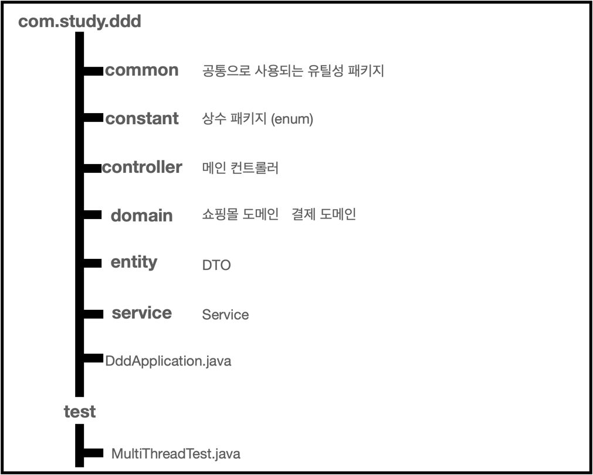
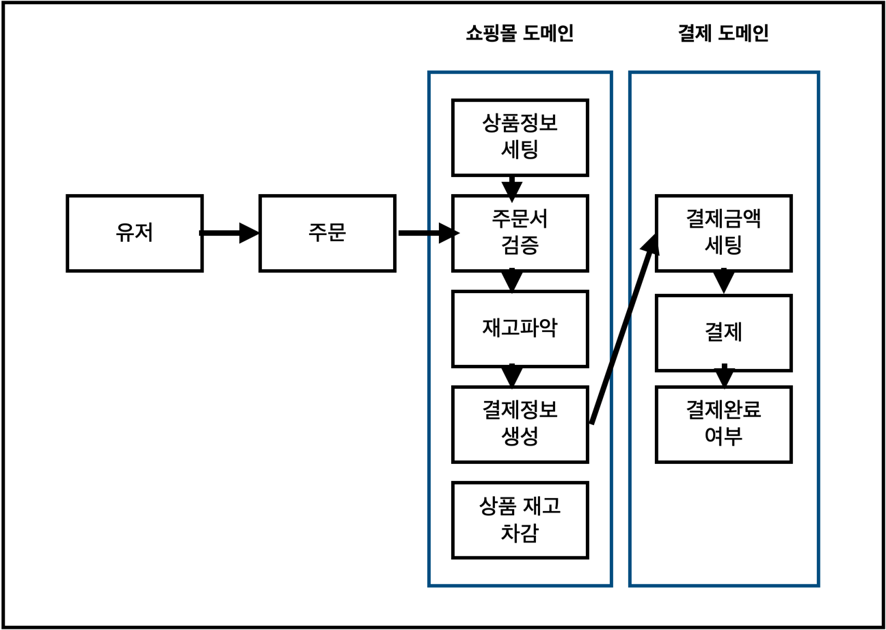

# DDD-demo

---
쇼핑몰에서 어떠한 물건을 구매하는 시나리오를 DDD로 설계하기  
유저는
1. 물건을 검색하고
2. 원하는 물건을 선택
3. 쇼핑몰에 결제를 요청한다.

쇼핑몰의 입장에선
1. 현재 물건 정보를 가져오고
2. 유저를 통해 전달받은 주문서를 검증하며
3. 현재 재고를 파악하고
4. 결제되는 정보를 결제 모듈에 전달한다.
5. 결제가 완료되면 재고를 차감

결제모듈은
1. 쇼핑몰에서 전달받은 주문서로 배송비, 결제 금액 기타 정보를 생성하고
2. 최종 정보를 PG사를 통해 결제를 진행한다.

위 시나리오에선 유저, 쇼핑몰, 결제 부분은 해당 프로그램의 주요 도메인이며  
특정 도메인을 비즈니스 로직에 맞춰 개발하는 목적

---
## 스펙

java8

SpringBoot 2.6.4

Lombok

Maven

---

## 패키지 구조

---

## 패키지 내 파일

- common
  - CommandLineAppStartupRunner.java : App 메인함수 실행 시 호출되는 클래스
  - CsvManager.java : csv 파일을 읽어들이는 기능 담당 클래스
  - PrintUtil.java : 콘솔화면의 출력을 담당 클래스

- constant
  - CommandKey.java : 콘솔화면에 입력될 커맨드를 관리하는 enum
  

- controller
  - AppController.java : 메인컨트롤러, 콘솔 입력값으로 기능제어

  
- domain
  - ShoppingMall.java : 쇼핑몰 도메인, 재고, 주문, 검증 기능 담당
  - Pay.java : 결제 도메인, 결제정보 세팅과 PG사 연동
  
- service
  - ItemService.java : 상품 기능 인터페이스
  - ItemServiceImpl.java : 상품인터페이스의 구현체

- test
  - MultiThread.java : 멀티스레드 주문테스트

---

## 비즈니스 다이어그램

---
## 개발방향

1. App 실행 시 CommandLineAppStartupRunner 메인컨트롤러 호출(AppController)
2. 출력만 담당하는 클래스 분리 생성
3. csv 담당 클래스 분리 생성
4. AppController 는 input 명령어를 통해 메인페이지, 주문, 앱종료 등의 기능을 제어(Spring 컨트롤러와 비슷한 컨셉)
5. 콘솔의 o, order, q, quit 명령어는 enum을 통해 관리
6. 쇼핑몰 도메인은 상품의 재고, 주문, 검증 기능을 담당하도록 설계
7. 결제 도메인은 결제정보 생성을 위해 빌더 패턴으로 관리하며 PG모듈과 연동된다는 것을 가정
8. 상품 서비스는 csv파일에서 상품리스트를 생성하는 기능 담당
9. 쇼핑몰 도메인의 결제 기능에서 멀티스레드 SoldOutException 기능 구현을 위해 
   1. 상품리스트는 ConcurrentHashMap으로 관리
   2. 주문 기능에서 synchronized 키워드 사용
